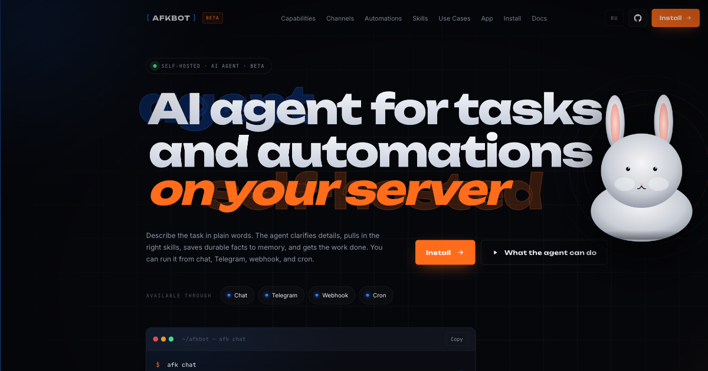

<h1 align="center">AFKBOT</h1>

<p align="center">
  Local AI runtime and CLI for chat, durable task orchestration, browser automation,
  plugins, MCP, channels, and profile-scoped subagents.
</p>

<p align="center">
  <a href="https://afkbot.io">Site</a> ·
  <a href="https://afkbot.io/docs">Docs</a> ·
  <a href="LICENSE">License</a> ·
  <a href="TRADEMARKS.md">Trademarks</a>
</p>

<p align="center">
  
</p>

## What AFKBOT is

AFKBOT is a source-available local agent platform. You can run it from the terminal,
keep work inside chat, fan out to subagents, or move long-running work into Task Flow
with durable tasks, dependencies, and review steps.

Use AFKBOT when you want:

- local chat with tools and configurable reasoning
- profile-scoped skills, subagents, permissions, and secrets
- browser, MCP, app, webhook, channel, and automation surfaces
- durable background work instead of one large chat turn

For the full command reference and setup details, use [afkbot.io/docs](https://afkbot.io/docs).

## Install AFKBOT

### Linux and macOS

```bash
curl -fsSL https://afkbot.io/install.sh | bash
```

### Windows PowerShell

```powershell
powershell -c "irm https://afkbot.io/install.ps1 | iex"
```

After install, open a new terminal and run:

```bash
afk setup
afk doctor
afk chat
```

The hosted installer bootstraps `uv`, installs AFKBOT as an isolated tool, and keeps
runtime state outside the source tree.

## Install from a source checkout

Manual source installs require Python 3.12+ and `uv`.

```bash
uv sync --extra dev
uv run afk setup
uv run afk doctor
uv run afk chat
```

If you want a shell-installed `afk` binary directly from the checkout:

```bash
bash scripts/install.sh --repo-url "file://$PWD"
```

## Main features

| Feature | What it is | First commands |
| --- | --- | --- |
| Profiles | Isolated runtime agents with their own model, policy, secrets, skills, subagents, channels, and memory. | `afk profile add work`, `afk profile show work`, `afk profile list` |
| Skills | Profile-local markdown instructions the agent can load and use while working. | `afk skill set research-helper --from-file ./research-helper.md`, `afk skill list --profile default` |
| Subagents | Specialized child workers under one profile, each with its own descriptor and prompt. | `afk subagent set reviewer --from-file ./reviewer.md`, `afk subagent list --profile default` |
| Task Flow | Durable tasks, flows, dependencies, review queues, and background execution. | `afk task flow-create --profile default --title "Website launch"`, `afk task board --profile default` |
| Automations | Scheduled or webhook-triggered work that runs in the background. | `afk automation create ...`, `afk automation list --profile default` |
| Channels | External transports that route messages into a profile. | `afk channel telegram add`, `afk channel telethon add`, `afk channel list` |
| Browser | Local browser runtime for `browser.control`. | `afk browser install`, `afk browser status` |
| Plugins | Optional platform extensions such as AFKBOT UI. | `afk plugin install`, `afk plugin list` |
| MCP | Remote MCP servers connected to a profile. | `afk mcp connect https://example.com/mcp --profile default`, `afk mcp list --profile default` |
| Memory | Scoped semantic memory for profile, chat, thread, and user-in-chat contexts. | `afk memory list --profile default`, `afk memory search "topic" --profile default` |

## Common setup flows

### Create a new profile

Use a profile when you want a separate agent with its own provider, model, permissions,
skills, subagents, channels, and memory.

```bash
afk profile add work
afk profile show work
afk profile list
```

`afk setup` creates or reconfigures the default profile. `afk profile add` is for
additional profiles such as `work`, `support`, or `research`.

### Create a skill

Skills are reusable markdown playbooks that the profile can load during work.

```bash
afk skill set research-helper --from-file ./research-helper.md
afk skill list --profile default
afk skill show research-helper --profile default
```

To install a community or GitHub-hosted skill instead of writing one locally:

```bash
afk skill marketplace search "review"
afk skill marketplace install default --skill <skill-name>
```

### Create a subagent

Subagents are profile-local specialists. They are usually invoked from `afk chat`,
Task Flow, or orchestrated runtime flows.

```bash
afk subagent set reviewer --from-file ./reviewer.md
afk subagent list --profile default
afk subagent show reviewer --profile default
```

If you need a direct persisted subagent run from CLI:

```bash
afk subagent run --profile default --name reviewer --session cli-demo --prompt "Review this plan"
```

### Start Task Flow

Use Task Flow when the work should survive the current chat turn, have dependencies,
or go through review.

```bash
afk task flow-create --profile default --title "Website launch"
afk task create --profile default --title "Draft landing copy" --prompt "Write first landing page draft"
afk task board --profile default
```

### Create an automation

Automations run prompts on a schedule or from a webhook. They are executed by the
local runtime, so keep `afk start` running.

Cron example:

```bash
afk automation create \
  --profile default \
  --name "Daily digest" \
  --prompt "Summarize open work and propose the next action." \
  --trigger cron \
  --cron-expr "0 9 * * 1-5" \
  --timezone Europe/Moscow

afk automation list --profile default
```

Webhook example:

```bash
afk automation create --profile default --name "Inbound event" --prompt "Process webhook payload." --trigger webhook
```

### Add a channel

Channels connect outside conversations to a selected profile. The profile still owns the
agent persona, memory, skills, and maximum permissions; channel settings narrow how that
profile is exposed through one transport.

Telegram bot polling:

```bash
afk channel telegram add
afk channel telegram status
```

Telegram Bot polling now enriches inbound updates with downloadable attachments for
voice, audio, documents/files, photos/images, video, animation, video notes, and
stickers. Files are downloaded into the profile workspace under
`channel_attachments/telegram/<endpoint_id>/<update_id>/...`, and the agent turn gets
path, kind, mime type, size, plus text previews for text-like files. Downloaded
stickers keep their Telegram format extensions: static `.webp`, animated `.tgs`, and
video `.webm`. Inline `callback_query` button presses are converted into
agent-readable text with the pressed button text, `callback_data`, and the original
message; forum-topic callbacks also preserve `message_thread_id` for topic routing, and
the runtime best-effort acknowledges them through Telegram `answer_callback_query`.

For a private 1:1 bot, use the interactive wizard and choose:

- `Private chat access`: `allowlist`
- `Allowed private sender ids`: your Telegram numeric user id
- `Group access`: `disabled` if the bot should never work in groups
- `Channel tool profile`: `messaging_safe` for chat plus memory/send, or `support_readonly`
  when the bot may also read/search project files
- `Restrict channel.send outbound targets`: `Yes`
- `Allowed outbound chat/user ids`: the same Telegram user id or group id that the agent may message
- `Create matching routing binding`: `Yes`
- `Binding session policy`: `per-chat`

For groups, prefer `Group access: allowlist`, enter the allowed group ids, and enter the
allowed sender user ids. Use `per-thread` for topic-based groups and `per-user-in-group`
when each group member needs a separate conversation context.

The same settings can be passed as flags:

```bash
afk channel telegram add owner-bot \
  --private-policy allowlist --allow-from 123456789 \
  --group-policy allowlist --groups -1001234567890 --group-allow-from 123456789 \
  --outbound-allow-to 123456789 \
  --binding
```

Telethon user account:

```bash
afk channel telethon add
afk channel telethon authorize <channel_id>
afk channel telethon status
```

The same access flags are available for Telethon userbot channels. Inside an allowed
profile, the agent can send explicit outbound channel messages with `channel.send`;
safe channel tool profiles allow that tool while still blocking broad `app.run`. If
the wizard `Restrict channel.send outbound targets` step or `--outbound-allow-to`
is configured, `channel.send` can only target those peer ids.

`channel.send` still supports plain text, and now also accepts structured Telegram
messages with `parse_mode`, `disable_web_page_preview`, Bot API-style `reply_markup`
inline/reply keyboards, `attachments` of kind `photo`, `document`, `voice`, `audio`,
`video`, `animation`, `sticker`, and `stream_draft`. For Telegram Bot channels,
`stream_draft` sends best-effort `sendMessageDraft` preview chunks only for private
chats before the final message. For group, supergroup, channel, and forum targets,
AFKBOT skips draft previews and still sends the final message normally. Bot API local
media uploads are also bounded by `channel_media_upload_max_bytes` and Telegram local
upload caps: 10 MB for photos and 50 MB for other local uploads. It is not
token-by-token model streaming; the final agent response is still delivered from the
normal final-text path.

Telethon inbound messages now save downloaded media into
`channel_attachments/telegram_user/<endpoint_id>/<message_id>/...` and attach
path, mime type, size, plus previews for text-like files to the agent turn. They also
honor `channel_media_download_max_bytes`: oversized files are skipped before download
when size metadata is available, or deleted and reported after download when size is
only known after save. Downloaded stickers keep their Telegram format extensions:
static `.webp`, animated `.tgs`, and video `.webm`. Outbound rich messages use
Telethon `send_file`, preserve parse modes, resolve local attachments through the same
workspace path and scope checks as Telegram Bot local media, and do a best-effort
conversion of Bot API-like inline/reply keyboards into Telethon buttons. Outside-scope
local paths are rejected; remote/http sources or opaque non-path values still pass
through when they do not look like local paths.

Useful channel tool-profile presets:

- `chat_minimal`: reply only, no tools exposed from the channel
- `messaging_safe`: reply plus `channel.send` and safe memory tools
- `support_readonly`: `messaging_safe` plus read-only file list/read/search and diff render
- `inherit`: use the profile ceiling directly; reserve this for fully trusted channels

Overview:

```bash
afk channel list
```

Telegram media and rich outbound delivery were verified with:

```bash
uv run pytest tests/services/channels/telegram_polling/test_support.py tests/services/channels/test_channel_delivery_service.py::test_channel_delivery_service_skips_draft_stream_for_non_private_telegram_target tests/services/channels/telethon_user/test_runtime_ingress.py::test_telethon_user_service_sends_rich_live_message tests/services/channels/telethon_user/test_runtime_ingress.py::test_telethon_user_service_rejects_attachment_paths_outside_workspace tests/services/channels/telethon_user/test_runtime_ingress.py::test_telethon_user_service_splits_long_rich_text_after_file_send tests/services/channels/telethon_user/test_runtime_ingress.py::test_telethon_user_service_skips_oversized_media_before_download tests/services/channels/telethon_user/test_runtime_ingress.py::test_telethon_user_service_deletes_oversized_media_after_download tests/services/tools/test_app_plugins.py::test_telegram_local_media_upload_rejects_oversized_file
uv run pytest tests/services/channels/test_channel_delivery_service.py tests/services/tools/test_channel_send_tool.py tests/services/tools/test_app_plugins.py tests/services/channels/telegram_polling tests/services/channels/telethon_user
uv run ruff check afkbot/services/apps/telegram/actions.py afkbot/services/apps/telegram/http_api.py afkbot/services/channels afkbot/services/tools/plugins/channel_send/plugin.py afkbot/settings.py tests/services/channels tests/services/tools/test_app_plugins.py tests/services/tools/test_channel_send_tool.py
uv run mypy afkbot
```

## Install browser runtime

To enable `browser.control`, install the active browser backend:

```bash
afk browser install
afk browser status
```

Default backend:

- `playwright_chromium` for the easiest local setup

Good option for Linux servers:

```bash
afk browser backend lightpanda_cdp
afk browser cdp-url http://127.0.0.1:9222
afk browser install
```

## Install a plugin

AFKBOT supports embedded plugins. The default curated path is the AFKBOT UI plugin.

Interactive install:

```bash
afk plugin install
```

Direct install from GitHub:

```bash
afk plugin install github:afkbot-io/afkbotuiplugin@main
```

Useful follow-up commands:

```bash
afk plugin list
afk plugin inspect afkbotui
afk start
```

## Daily commands

| Command | What it does |
| --- | --- |
| `afk chat` | Start interactive chat or run one turn with `--message` |
| `afk start` | Start the local runtime, API, automations, and workers |
| `afk task board --profile default` | Open the Task Flow backlog for a profile |
| `afk subagent list --profile default` | Show subagents available to the profile |
| `afk mcp list --profile default` | Show saved MCP servers for a profile |
| `afk logs` | Show diagnostic error log files and their path |
| `afk update` | Update the installed AFKBOT build |

## Core model

Keep the mental model simple:

- `afk chat` for work you want done now
- subagents for specialized work under the current profile
- `Task Flow` for durable tasks, dependencies, handoffs, and review
- `afk start` when you want the local runtime stack running continuously

## License

AFKBOT is source-available under the `Sustainable Use License 1.0`.

- personal, non-commercial, and internal business use are allowed
- modifying and forking are allowed
- selling AFKBOT, reselling copies, or offering it as a paid hosted or white-label service requires separate permission
- the repository does not grant trademark rights to the AFKBOT name or branding

See [LICENSE](LICENSE), [LICENSE_FAQ.md](LICENSE_FAQ.md), and [TRADEMARKS.md](TRADEMARKS.md) for the full terms.
